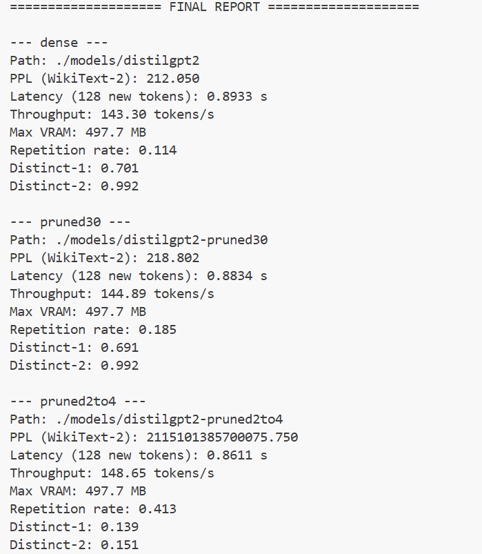

项目目的是为了对gpu-mode课程Sparsity进行实践
我的显卡型号是3060Laptop 显存为6GB
由于显存比较小, 经过测试可用的显存为4.99GB
因此采取比较小的模型进行学习练习

本次实验采取了两种Sparsity策略, 
1.非结构化30%稀疏化方式
2.2:4结构化稀疏化方式

在prune_gpt2.py下将model的参数采取第一种方式将model存储到./models/distilgpt2-pruned30
在struct_sparsity.py采取第二种方式存储到./models/distilgpt2-2to4-sft

测试参数为
PPL (WikiText-2)
Latency (128 new tokens)
Throughput
Max VRAM
Repetition rate
Distinct-1
Distinct-2

测试结果如下图:

原模型与非结构化稀疏化的对比:
质量（PPL）
dense PPL = 212.050
pruned30 PPL = 218.802
相对变化：+3.18%（变差）

速度（Latency / Throughput）
Latency：1.0477s → 0.9202s
降低 12.2%
Throughput：122.17 → 139.09 tokens/s
提升 13.8%

显存:两者 max VRAM 一样（497.7MB）

文本统计指标

repetition rate：0.141 → 0.150（略差）
distinct- 1/2：都更高（略好）

再看2:4 结构化稀疏模型
PPL 爆炸到 2.1e15, 文本高度重复、退化 

查阅资料后得到一个重要信息
2:4 structured sparsity 不能使用，必须配合微调

在make_2to4_and_mask中使用较小的文本进行训练2000次
在使用mask保证之前结构化稀疏化的 2:4 mask 不变

再次运行测试脚本得到了:

看到ppl这个参数只有46.923, 可以解读出有些过拟合了

未来展望: 解决过拟合的问题